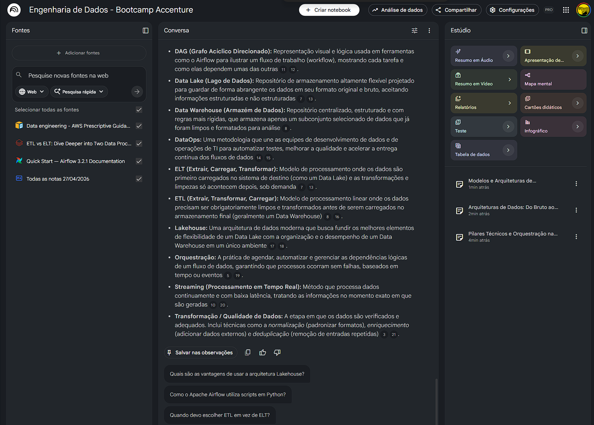

# 📓 Caderno Temático NotebookLM: Engenharia de Dados

Este repositório contém o desafio de projeto focado no uso da Inteligência Artificial (NotebookLM) como ferramenta de curadoria e aprendizado ativo, parte do **Bootcamp Accenture - Python: Análise e Automação de Dados**.

## 🎯 Contexto e Objetivos

O objetivo deste caderno temático é utilizar o NotebookLM para mapear os fundamentos da Engenharia de Dados, construindo um vocabulário sólido e entendendo o ciclo de vida dos dados, desde a extração até a orquestração em nuvem. O foco é transformar documentações densas em um guia de consulta rápida para apoiar o desenvolvimento prático ao longo do bootcamp.

**Objetivos de Estudo:**
1. Compreender o que é um pipeline de dados e as diferenças arquiteturais entre **ETL** e **ELT**.
2. Entender os diferentes tipos de armazenamento (Data Warehouse, Data Lake e Lakehouse).
3. Compreender a orquestração de fluxos de trabalho utilizando Apache Airflow e a cultura de DataOps.

---

## 📚 Curadoria de Fontes

Para alimentar o NotebookLM com informações precisas e evitar alucinações da IA, foram utilizadas as seguintes documentações oficiais de mercado:

1. **[AWS] Data engineering - AWS Prescriptive Guidance:** Visão geral e melhores práticas de engenharia de dados na nuvem.
2. **[Databricks] ETL vs ELT: Dive Deeper into Two Data Processing Methods:** Artigo técnico comparando as abordagens de processamento e escalabilidade.
3. **[Apache] Quick Start - Airflow 3.2.1 Documentation:** Guia oficial de introdução à ferramenta padrão de orquestração de pipelines.

*(Nota: Os arquivos PDF destas fontes foram carregados no meu ambiente privado do NotebookLM).*

---

## 🛠️ Engenharia de Prompts e "Cicatrizes"

Abaixo está o registro das iterações e testes de prompts realizados, demonstrando o refinamento do raciocínio investigativo para extrair as melhores respostas.

* **Prompt Inicial (Muito amplo):** *"O que um Engenheiro de Dados faz no dia a dia?"*
* **Troubleshooting (A Cicatriz):** A resposta inicial foi genérica. Para obter algo voltado ao meu bootcamp, refinei a pergunta exigindo base nas fontes e correlação com programação.
* **Prompt Refinado:** *"Com base nas fontes anexadas, liste as 3 principais responsabilidades técnicas de um Engenheiro de Dados e explique como a linguagem Python se encaixa nessas responsabilidades."*

**Outros prompts exploratórios utilizados:**
* *"Qual a diferença entre Data Lake e Data Warehouse?"*
* *"Explique Batch vs Streaming de forma simples"*
* **Prompt de Consolidação Final:** *"Com base nas notas selecionadas, crie um resumo estruturado para iniciantes e um glossário com os principais termos técnicos"*

---

## 📘 Miniguia de Estudo: Engenharia de Dados

Consolidação dos principais insights gerados pelo NotebookLM a partir das fontes fornecidas.

### 1. Resumo Estruturado do Assunto
Os documentos exploram os fundamentos da engenharia de dados, detalhando estratégias para **automatizar e orquestrar fluxos de trabalho** em ambientes de nuvem. As fontes comparam as metodologias **ETL e ELT**, destacando como a ordem das operações influencia a escalabilidade, flexibilidade e conformidade no processamento de informações (estruturadas e não estruturadas). 

Há uma ênfase especial no uso de serviços gerenciados, como AWS Glue e Databricks, para simplificar a infraestrutura. Além disso, destaca-se o uso de ferramentas de **orquestração programática**, como o **Apache Airflow**, com o objetivo central de promover a democratização dos dados e a integração de práticas de **DataOps** para garantir qualidade e eficiência organizacional.

### 2. Glossário Técnico
* **DAG (Grafo Acíclico Direcionado):** Representação visual e lógica usada em ferramentas como o Airflow para ilustrar um fluxo de trabalho (workflow), mostrando cada tarefa e como elas dependem umas das outras.
* **Data Lake (Lago de Dados):** Repositório de armazenamento altamente flexível projetado para guardar de forma abrangente os dados em seu formato original e bruto.
* **Data Warehouse (Armazém de Dados):** Repositório centralizado, estruturado e com regras mais rígidas, que armazena apenas um subconjunto de dados já limpos e formatados para análise.
* **DataOps:** Uma metodologia que une as equipes de desenvolvimento de dados e de operações de TI para automatizar testes e acelerar a entrega contínua dos fluxos de dados.
* **ELT (Extrair, Carregar, Transformar):** Modelo de processamento onde os dados são primeiro carregados no sistema de destino (como um Data Lake) e as transformações acontecem depois, sob demanda.
* **ETL (Extrair, Transformar, Carregar):** Modelo de processamento linear onde os dados precisam ser obrigatoriamente limpos e transformados antes de serem carregados no armazenamento final.
* **Lakehouse:** Arquitetura de dados moderna que busca fundir a flexibilidade de um Data Lake com a organização e desempenho de um Data Warehouse.
* **Orquestração:** A prática de agendar, automatizar e gerenciar as dependências lógicas de um fluxo de dados.
* **Streaming (Processamento em Tempo Real):** Método que processa dados continuamente e com baixa latência, tratando as informações no momento exato em que são geradas.
* **Transformação / Qualidade de Dados:** Etapa de verificação e adequação dos dados (ex: normalização, enriquecimento e deduplicação).

### 3. Prompts Reutilizáveis (Para Revisão Futura)
* *"Quais as principais diferenças entre as abordagens ETL e ELT na AWS?"*
* *"Como o Apache Airflow auxilia na orquestração de fluxos com scripts em Python?"*
* *"Explique o conceito de DataOps e dê 3 exemplos de seus benefícios práticos."*